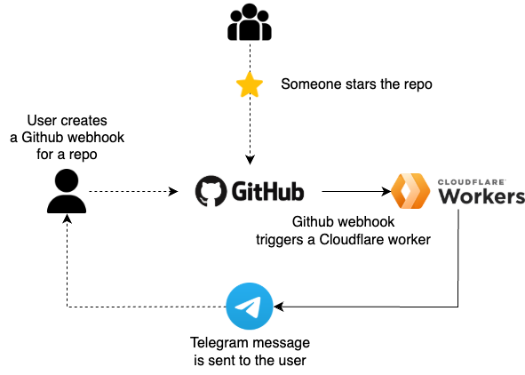

<!-- deno-fmt-ignore-file -->
# ⭐ Github Starboy

> _A simple tool for sending Telegram notifications whenever your repo gets a new ⭐_

<p align="center">
  
</p>

## How it works?

This project utilizes the [Github webhook](https://docs.github.com/en/webhooks/webhook-events-and-payloads#star) that is triggered whenever someone adds or removes a star from the specified repository.<br/>
After that, the webhook triggers a Cloudflare worker that runs the [Deno](https://deno.com/) code.

The worker first validates whether the request is valid and comes from the trusted source (Github) by verifying the HMAC signature of the request.

If it passes, it initializes a Telegram API and sends a message to the specified chat.

#### Telegram setup
To obtain the required env variables `TELEGRAM_API_KEY` and `TELEGRAM_CHAT_ID` you will first need to create a **Telegram Bot** and get the chat ID (between you and the bot).

You can follow the steps described [here](https://gist.github.com/dideler/85de4d64f66c1966788c1b2304b9caf1).

### Local dev
If you want to run this locally, you can run 
```bash
$ deno task dev
```
this will make the worker run locally on `http://localhost:8000`.

Be sure to expose your URL on the internet to be able to register it in the Github webhooks, for example by using [ngrok](https://ngrok.com/).

### Deploying
This project uses [Denoflare](https://denoflare.dev/) that handles bundling of the Javascript code that uses Deno and deploys it to the Cloudflare platform.

First, make sure you have your environment variables set up (see `.env.example`).
Then, just run 
```bash
$ deno task deploy
```
This will authenticate with Cloudflare, build the code, and push it (including the secrets) 🚀.

#### Disclaimer
At the time of writing this (02/2025), Denoflare seems to be outdated and doesn't keep up with the Deno (and Cloudflare) release schedule, so some things are broken and you need to search for the answers in the GitHub issues.<br/>
Also, it's limited in what it supports from Cloudflare, for instance, it doesn't seem to be possible to configure logging in the `.denoflare` file, while this is supported in the official [Wrangler](https://developers.cloudflare.com/workers/wrangler/) tool.

This was only a weekend pet project, so idc, but if I were to use Deno and Cloudflare workers again in the future, I'd definitely stick to the official Wrangler tool and maybe figure out the Deno compilation nuances myself.
